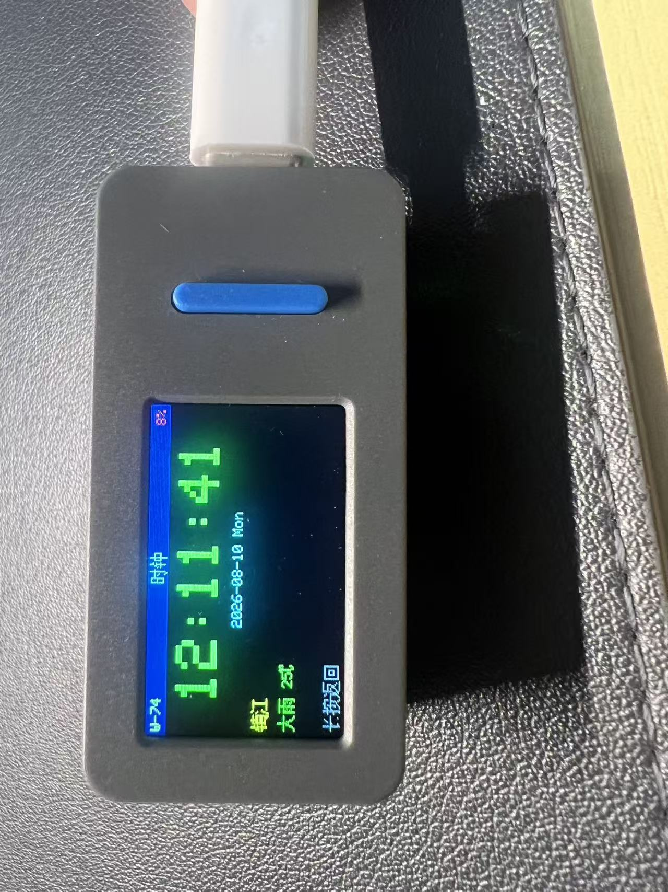
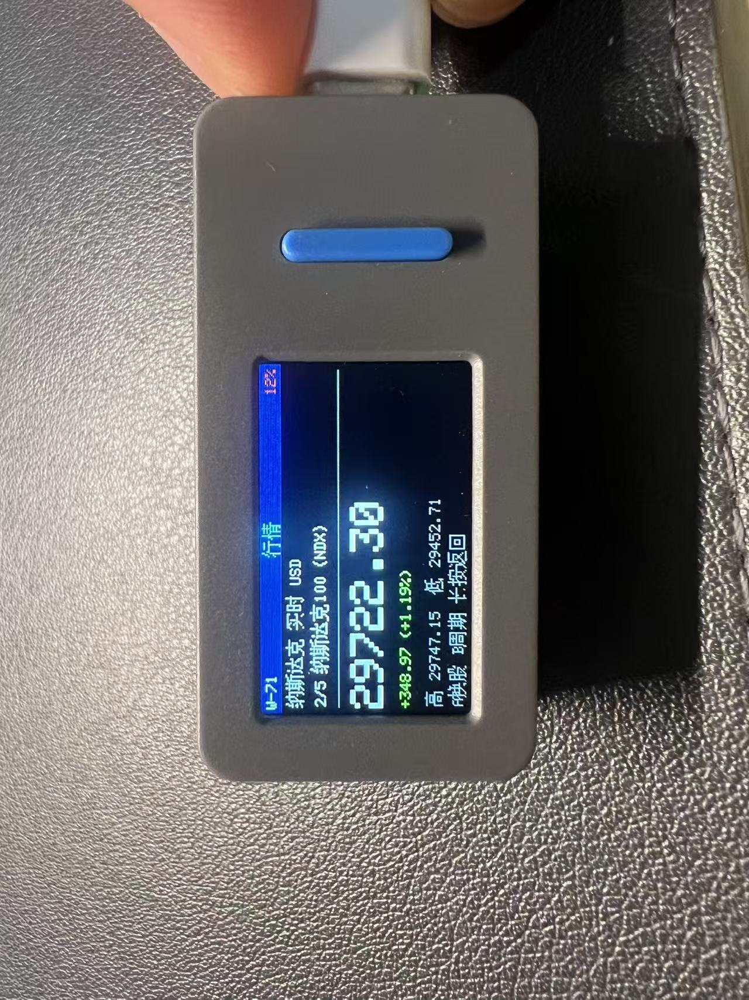
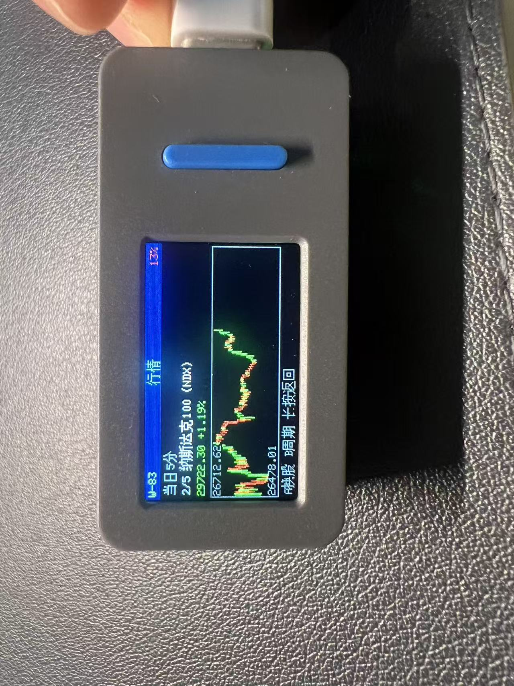

# ESP32 Stock Clock (M5StickS3)

[](https://1yzz.github.io/esp32_stock_clock/)
[](https://github.com/1yzz/esp32_stock_clock/actions/workflows/deploy-webflash.yml)
[](https://github.com/1yzz/esp32_stock_clock/stargazers)
[](https://docs.m5stack.com/en/core/M5StickS3)
[](https://platformio.org/)

基于 **PlatformIO + Arduino + M5Unified** 的口袋行情时钟：大号时钟与天气、A 股/美股报价、多周期 K 线，以及 SoftAP 网页配置。

## Screenshots

| 时钟 + 天气 | 实时报价 | 当日 5 分 K |
|-------------|----------|-------------|
|  |  |  |

## Features

- **时钟**：霓虹绿大号时间、日期；国内 IP 定位城市 + 心知天气
- **行情**：Yahoo 风格报价（价 / 涨跌 / 高低）；中文名（A 股优先东财 UTF-8）
- **K 线**：当日 5 分、3 天 30 分、7 天 60 分、30 天日 K、完整日 K；分桶缓存 + 可配置 TTL
- **配置页**：扫描 WiFi、增删股票、调整 K 线缓存 TTL
- **功耗**：STA 连上后关闭 SoftAP；降低背光与 CPU 频率（进「配置」页会再开 AP）

## Hardware

- [M5StickS3](https://docs.m5stack.com/en/core/M5StickS3)（ESP32-S3，1.14″ 屏，KEY1 / KEY2）
- 开发：PlatformIO `env:m5sticks3`

## Build / Flash

```bash
pio run -e m5sticks3
pio run -e m5sticks3 -t upload
pio device monitor
```

烧录：长按侧边复位约 2 秒至绿灯闪；或关机后按住 **BtnA** 再插 USB。

### 浏览器烧录（Web Serial / GitHub Pages）

公开安装页（push 到 `main` 后由 Actions 自动更新）：

**https://1yzz.github.io/esp32_stock_clock/**

Chrome / Edge 打开 → 点 **Install** → 选串口。进不了下载模式时：关机后按住 **BtnA** 再插 USB。

本地预览：

```bash
pio run -e m5sticks3 -t webflash
npx --yes serve webflash
```

原理：[ESP Web Tools](https://esphome.github.io/esp-web-tools/) + `scripts/prepare_webflash.py` 合并镜像；工作流见 `.github/workflows/deploy-webflash.yml`。

首次启用 Pages：仓库 **Settings → Pages → Source** 选 **GitHub Actions**，再跑一次 workflow（或 push / 手动 Run）。

## Controls

| 场景 | A | B | 长按 |
|------|---|---|------|
| 主菜单 | 进入 | 下一项 | — |
| 时钟 | — | — | 回菜单 |
| 行情 | 下一只股票 | 切换视图（报价 / 各周期 K） | 回菜单 |
| 配置 | — | — | 回菜单 |

主菜单项：时钟 / 行情 / 配置。

## Web config

| 项 | 值 |
|----|-----|
| SoftAP SSID | `M5StickS3-Clock` |
| SoftAP 密码 | `12345678` |
| SoftAP 页面 | `http://192.168.4.1` |
| STA 已连接 | 用设备局域网 IP；日常 SoftAP 关闭，进「配置」页会临时开启 |

股票代码示例：`s_sh000001`、`sz000001`、`s_usNDX`、`s_usAAPL`。

网页可改：

- WiFi
- 股票列表（增删）
- K 线缓存 TTL（当日 / 中周期 / 日 K，单位：秒）

## Project layout

```
include/     board、配置、服务、UI 头文件
src/         main、ui、services、web、wifi、http、GBK
*.jpg        实机截图（时钟 / 报价 / K 线）
platformio.ini
```

## Notes

- 串口无输出：需 `ARDUINO_USB_CDC_ON_BOOT=1`（已在 `platformio.ini`）
- 天气 Key 为固件内置；城市由 IP 定位，无需网页填写
- 免费行情源有限流；请适当加大 TTL，避免频繁请求
- 电量：`M5.Power.getBatteryLevel()`；长按电源键约 6 秒硬件关机
